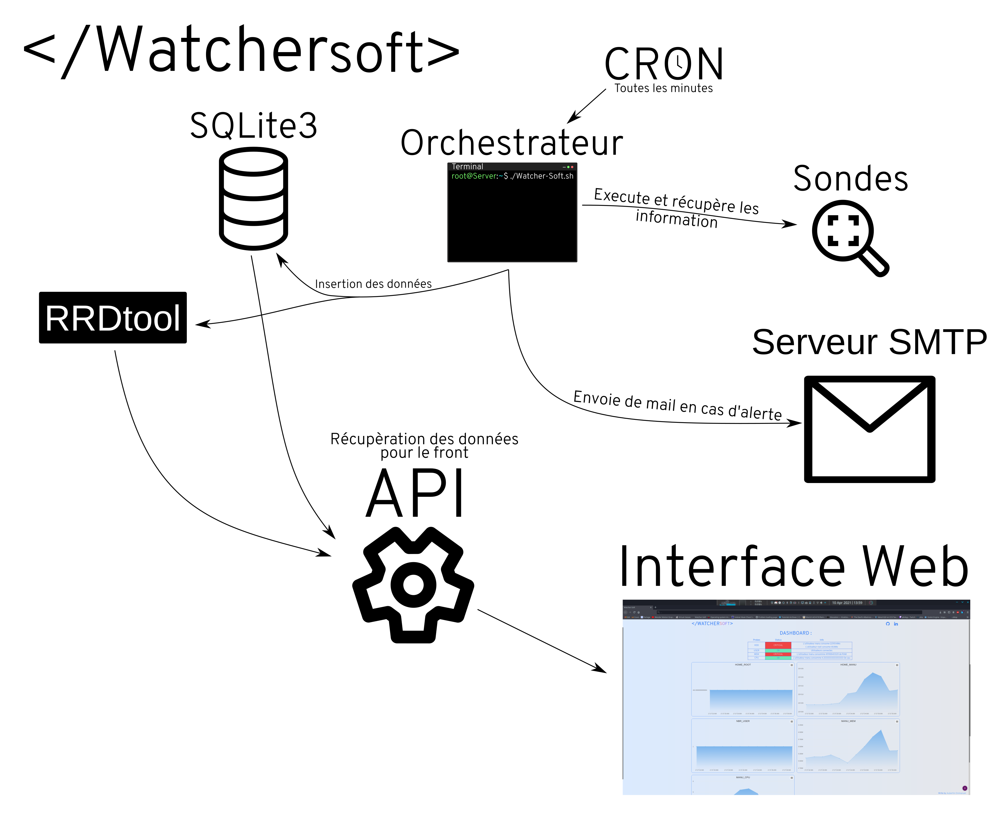
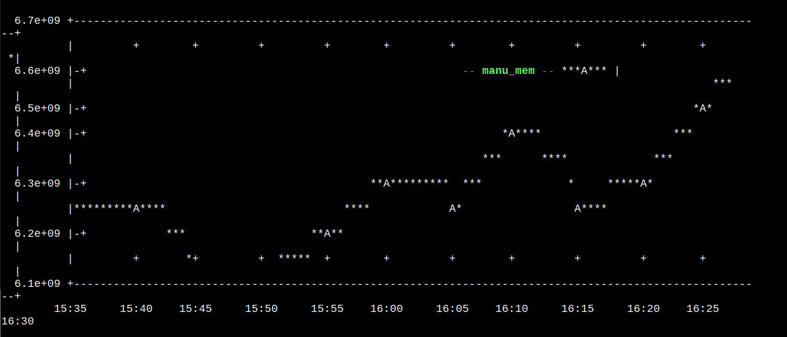

# **Watcher-Soft**

Watcher-Soft est un logicielle de monitoring pour Ubuntu serveur. Ce dernier a été développé dans le cadre d'un projet pédagogique à [l'université d'avignon](https://ceri.univ-avignon.fr/).

## **SOMMAIRE :**</br>
----
1. **[INSTALATION](#INSTALATION)**</br>
1. **[ARCHITECTURE](#ARCHITECTURE)**</br>
    - **[Collecte d’informations](#Collecte-d’informations)**</br>
    - **[Stockage et archivage](#Stockage-et-archivage)**</br>
    - **[Affichage](#Affichage)**</br>
    - **[Alerte](#Alerte)**</br>
    - **[L'orchestrateur](#orchestrateur)**</br>
    - **[Application web](#Application-web)**</br>
1. **[Mes choix face au sujet](#Mes-choix-face-au-sujet)**

<div id='INSTALATION'/>

## **INSTALATION**
----

```bash
wget https://raw.githubusercontent.com/Athomisos/Watcher-soft/main/install.sh && chmod +x install.sh && sudo ./install.sh
```
<div id='ARCHITECTURE'/>  

## **ARCHITECTURE**
----


<div id='Collecte-d’informations'/>

### **Collecte d’informations**

Dans Watcher-soft la collecte d'information est faite par des sondes (probes en anglais). Elles doivent toutes etre dans [probes/](probes/) pour etre executé. Ces sondes ont des nom et des sortie semi-structuré, ce qui permet l'ajout d’une nouvelle sonde sans modifié manuelle du code. Elles sont executées par [l'orchestrateur](#L'orchestrateur).

**Les nom :**</br>
Ils doivent être de la forme : `NOM_probe.ext`.

**Option par défaut :**</br>
La sonde doit contenir un commentaire avec les options par défaut, de faite, on a une gestion des critères de situation de crise qui sont configurables. Ce commentaire devra être de la forme suivante : 
```python
#défaut_OPTIONS=" --example 120 -Z 25"
```
 
**Les sorties :**</br>
Les sortie des sondes sont semi-structuré, elles doivent être de la forme :
```
STATE: Message utilisateur 1, Message utilisateur 2 | DisplayName_user1=value;warning_value;critical_value DisplayName_user2=value;warning_value;critical_value
```
Example de sortie de la sonde qui sureveille la RAM:
```
OK: L'utilisateur manu consomme 6483542016 de RAM  | manu_mem=6483542016;8000000000;12000000000; 
```
<div id='Stockage-et-archivage'/>

## **Stockage et archivage :**

Toutes les données sont dans le dossier [datas/](datas/). Par défaut il existe quatre sous répertoire, chacun étant dédier a un type de donnée particulier. Ces quatre sont :

**[sql/ :](datas/sql)** contient la database SQLite3.

**[png/ :](datas/png)** contient des histogrammes RRD.

**[rra/ :](datas/rra)** contient les RRA [(Round Robin Archive)](https://oss.oetiker.ch/rrdtool/doc/rrdtool.en.html).

**[dat/ :](datas/dat)** contient des fichiers texte avec la sortie d'un [RRDfetch](https://oss.oetiker.ch/rrdtool/doc/rrdfetch.en.html) .

La base de données SQLite3 est générée et mis à jour par l'orchestrateur, cela permet d'ajouter une sonde sans avoir a modifié manuellement la base de données.
<div id='Affichage'/>  

## **Affichage :**

Watcher-soft vous avez la possibilité de consulté les graphe depuis un terminal, pour ce faire, il vous suffira d'executé [watcher-cli.sh](cli/watcher-cli.sh).

Voici un exemple de graphe généré par [watcher-cli.sh](cli/watcher-cli.sh) :

<div id='Alerte'/>  

## **Alerte :**

Watcher-soft bénéficie d'un système d'alerte par mail, personnalisable tant to le contenu que l'envoi. En effet, vous avez la possibilité de personnaliser le contenue du mail avec le [template](alerters/templates/mail.txt). De plus, vous pouvez paramétrer l'envoie de mail grâce au fichier présent dans le dossier [alerters/conf](alerters/conf/). Dans le ficher [mail.conf.json](alerters/conf/mail.conf.json) vous rentrerez la configuration du serveur SMTP de votre choix. Ensuite, nous avons le fichier [receivers.conf](alerters/conf/receivers.conf), ici, il s'agit de choisir à qui l'on envoie le mail (RECEIVER), et qui sera en copie caché (BCC).
Pour envoyé un mail, il existe de manière, la première est de passer par l'api (voir [ici](#api)), et la seconde et de lancer le script [MAIL_alerters.sh](alerters/MAIL_alerters.sh)
<div id='orchestrateur'/>  
## **L'orchestrateur :**

L'orchestrateur est le cœur du Back-end de Watcher-soft. En effet, c'est à lui d'amorcer toutes les procédures d'exécution, allant de l'exécution des sondes, au script d'alerte. À chaque exécution, il veille au bon fonctionnement de Watcher-soft, en effet, il peut recréer la base de données, redémarré les services web...

Cependant, l'orchestrateur ne sert pas uniquement à cela, il doit également lancer toutes les sondes présentes dans [probes/](probes/). Une fois les sondes exécutées, il s'occupe de l'envoi de mail, de la mise à jour des donnée dans la base de données SQLite3 ainsi que des [RRA](https://oss.oetiker.ch/rrdtool/doc/rrdtool.en.html).

Une fois les bases de données mis a jours, il regener les fichier [dat](datas/dat).

Par défaut il sera lancer toute les minutes par la crontab.
<div id='Application-web'/>  

## **Application web :**

Watcher-soft possède une interface ergonomique, ainsi qu'une api. De cette manière, il est possible de modifier le front indépendamment du back et réciproquement indépendamment du back et réciproquement.

### **Interface web :**


L'interface web est disponible sur le port 80 de votre serveur. Il y a eu une page d'accueil qui sert de redirection vers la page dashboard ou vers la documentation. Vous trouverez toutes les informations système traquer pas les sondes dans la pages dashboard. Sur cette page est présent un tableau récapitulatif de l'état du système, ainsi que des histogramme traçant l'activité des utilisateurs de la dernière heure.

### **L'API :**
L'api de Watcher-soft est disponible sur le port `5000` de votre serveur. Il y a pour le moment cinq route api disponible : 
- [mail/](#mail)
- [img/rrd](#RRD-GRAPHE)
- [rrd/](#dat)
- [rrd/json/](#Get-dat-in-JSON-:)
- [probes](#get-probe)
### **Mail :**

Pour envoyer un mail vous pouvez envoyer une requette HTTP post. Cette route API n'est utilisable uniquement par 127.0.0.1 pour de raison de securité. La requête devra etre de la forme suivante :
```HTTP
POST /mail HTTP/1.1
Host: 127.0.0.1:5000/mail
Content-Type: application/json

{
    "title": "MAIL_TITLE",
    "body": "MAIL_BODY",
    "bcc": ["hide_guy@mail.com", "other_guy@mail.com"], // can be empty
    "MAIL_REPORT": "receiver@mail.com"
}
```

### **RRD GRAPHE :**
Pour obtenir le dernier graphique rrd au format PNG, il faut faire l'appelle suivant, si le graphique n'existe pas vous aurez un code HTTP 400.
Exemple de requête :
```HTTP
GET /img/rrd?name=latest-PROBENAME_probe.py-USERPROBE.png HTTP/1.1
Host: IP-SERVER:5000
```

### **Get dat :**
Vous avez la possibilité de récupérer la liste des fichier dat existant. Il vous suffit de faire un appel GET a /rrd, comme suis :
```HTTP
GET /rrd HTTP/1.1
Host: IP-SERVER:5000
```
### **Get dat in JSON :**
Si vous voulez récupère les données présente dans un fichier dat. Si le fichier dat demandé n'existe pas vous aurez un code HTTP 400. S'il existe vous aurait un tableau de tuple de la forme (epoch, value). Voici un exemple d'appelle :
```HTTP
GET /rrd/json?filename=NAME.dat HTTP/1.1
Host: IP-SERVER:5000
```
### **Get Probes :**

Cette route API permet d'avoir le contenue de la table `probes`, pour ce faire, il suffit de faire une simple requpête GET, comme ceci :
```HTTP
GET /probes HTTP/1.1
Host: IP-SERVER:5000
```
<div id='Mes-choix-face-au-sujet'/>  

## **Mes choix face au sujet :**

 1. Collecte d’informations :

Pour la collecte d'informations j'ai fait quatre sondes, deux en python ainsi que deux en bash (Source [ici](probe/)). Elles sont exécutées toutes les minutes par l'orchestrateur.

2. Stockage et archivage :

Dans cette partie, j'ai choisi d'utiliser une base de données sans serveur de type SQLite3. Pour stocké les données à caractère chronologique, j'utilise RRDtools.
La restauration de la base est faite par l'orchestrateur si besoin, de plus l'ajout d'une sonde ne nécessite aucune action manuelle (Voir [ici](#Collecte-d’informations))

3. Affichage & Alerte :

Pour l'affiche dans un terminal j'ai choisi d'utiliser la librairie gnuplot. La détection de crise est faite par l'orchestrateur, s'il détecte une crise, il envoie un mail au serveur SMTP de la faculté. Le contenu du mail est personnalisable grâce à un template.

4. Interface Web :

Pour ce qui est de l'interface web, j'ai utilisé Highchart ainsi que tailwindcss pour avoir un front dynamique et responsive.
